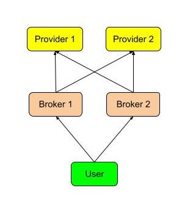
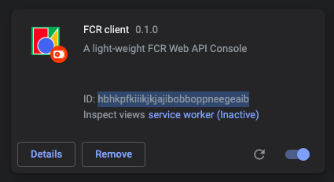
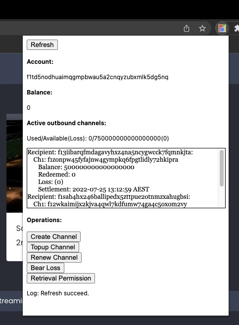
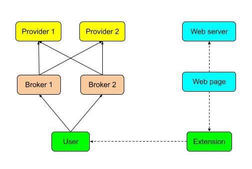
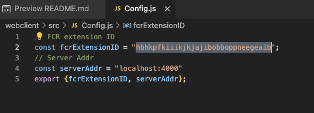
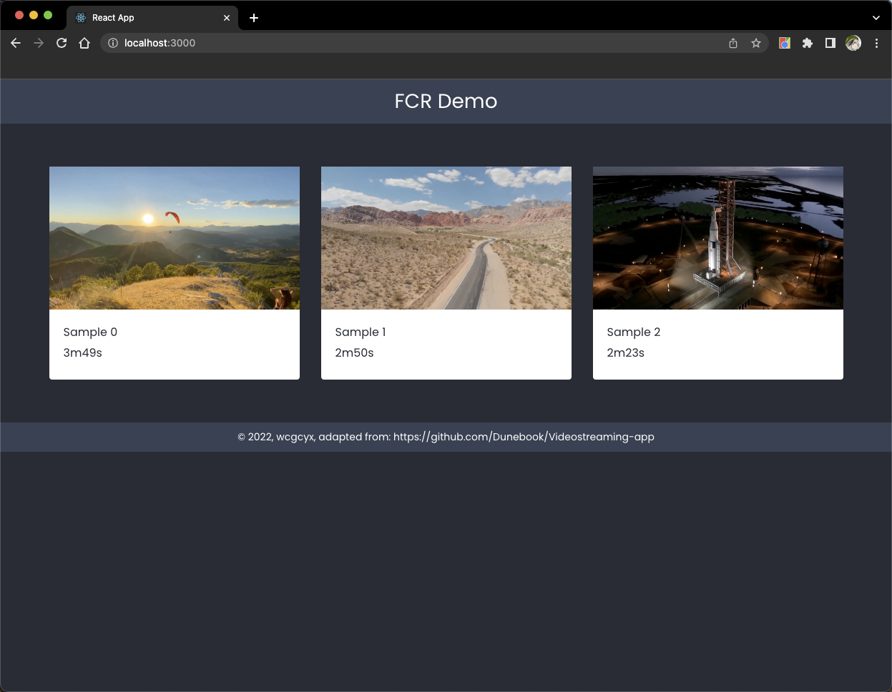

# FCR simple example
### Introduction
This repository shows a simple example for a web page that builds on top of [FCR](https://github.com/wcgcyx/fcr). This example is a simple video sharing website that allows people who runs FCR client to stream videos. However, unlike other video sharing website, the videos are not hosted by the website's server. Instead, segments of the videos are retrieved from the retrieval providers in the FCR network. To see the live demo did by me, see https://www.youtube.com/watch?v=WcRMIb0jvqs&t=394s

Follow the instructions below, you will be setting up a local FCR network of 5 nodes (2 retrieval providers, 2 payment providers and 1 client) that is used for data retrieval, a web server that hosts only the video IDs and a simple chrome extension that interacts with FCR client.
### Notice
You will need to have `docker` and the `fcr` image to continue the steps.

To build `fcr` image with version v0.1.2:
```
git clone https://github.com/wcgcyx/fcr.git
cd fcr/
git checkout v0.1.2
make docker
```

Also, I am NOT a front-end developer so a lot of example code may not make sense to you. You should never use any of the example code into production.
### Repo structure
`/extension` contains the code for a simple chrome extension.

`/network` contains the binary, configurations and scripts to run a local FCR network.

`/webclient` contains the code for the video sharing website.
### Instructions
#### 1. Setup local FCR network
```
cd network
docker compose up
```
(If you have run the demo previously and you wish to clean, run `docker compose down`)

Open another terminal:
```
./setup.sh
```
This script sets up the network by 1. initialising private keys for each node. 2. Connecting nodes. 3. Creating payment channels between nodes.

Then, to import sample videos into the two retrieval providers (Source: [sample0](https://www.youtube.com/watch?v=l8bD3IpNll8), [sample1](https://www.youtube.com/watch?v=-kUyorDlEmo), [sample2](https://www.youtube.com/watch?v=oe70Uhjc_F4)):
```
./import.sh ../samples/sample0.mp4
./import.sh ../samples/sample1.mp4
./import.sh ../samples/sample2.mp4
```
Note: The importing could take a while, please wait until it succeed.

In the end, you will get a local network that is similar to below, where each arrow represents a payment channel:


### 2. Install chrome extension
Load the unpacked extension under `/extension`. If you don't know how to do this, check [here](https://developer.chrome.com/docs/extensions/mv3/getstarted/#unpacked).

You will need to have the extension id, similar to this (in this example, the extension id is `hbhkpfkiiikjkjajibobboppneegeaib`):



After the extension is installed, you should see something like this:



Meanwhile, the overall system looks like this (FCR Proxy not included as it should be part of the extension):



### 3. Run web server
First, you need to configure the webserver by editing configuration file in:
```
./webclient/src/Config.js
```
You need to update the extension id as obtained in the last step:



Then you can start the web server:
```
cd ./webclient
npm install
npm run serve
```
This will launch a web server hosts video (only IDs).

## Demo
Now you can visit http://localhost:3000/ to stream videos. 



You can check the output of user terminal and the FCR proxy server to see things that are happening in the background. Try restart one of the providers or one of the brokers during the middle of a retrieval: You will see that FCR will atomatically switch to retrieve from the other provider or using the other broker as FCR loads data by content addressing, just like IPFS. If you are not familiar with content addressing, check [here](https://docs.ipfs.io/concepts/content-addressing/).

## Upload your own video
You will need to have:
```
1. A video in .mp4 format
2. The length of the video (For example, 3m20s for a video of 3 minutes and 20 seconds)
3. A poster of the video in .png format
```
For example, with a video named `sample.mp4`, first:
```
cd network
./import.sh sample.mp4
```
You should get a cid after the import succeed. 

Then you need to add the poster to `webclient/src/assets/posters` with the name to be `{$cid}.png`.

Finally, add a new entry to `webclient/src/assets/video_lists.json`.

## Disclaimer
The purpose of this repository is just to demonstrate a simple use case of FCR. You should not use the code for any production work. Check https://github.com/wcgcyx/fcr to obtain the latest version of FCR.

## Contributor
Zhenyang Shi - wcgcyx@gmail.com